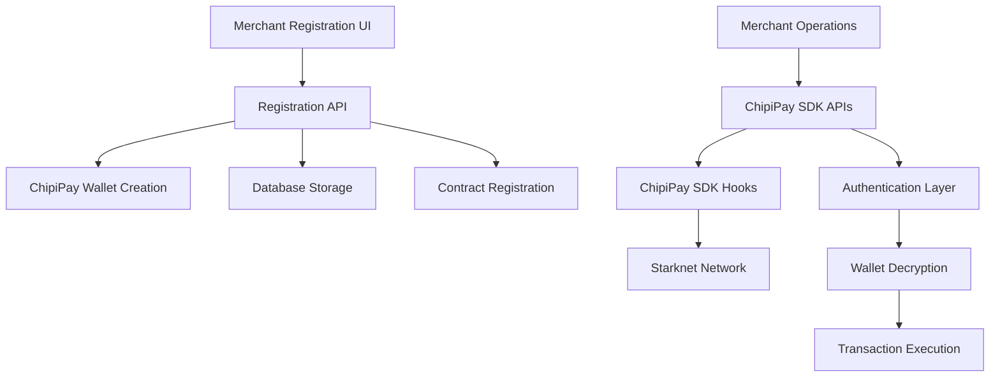

# Design Document

## Overview

This design outlines the integration of ChipiPay's invisible wallet creation and SDK functionality into the existing EgyptFi merchant registration system. The solution will automatically create invisible wallets during merchant signup and provide API endpoints for ChipiPay SDK operations, enabling merchants to perform blockchain transactions without complex wallet management.

The integration will modify the existing registration flow to collect only email and PIN, create invisible wallets using ChipiPay's infrastructure, and provide a comprehensive set of API endpoints for wallet operations.

## Architecture

### High-Level Architecture



### System Components

1. **Registration Service**: Modified merchant registration with ChipiPay wallet creation
2. **ChipiPay Integration Layer**: Wrapper around ChipiPay SDK functions
3. **API Gateway**: RESTful endpoints for wallet operations
4. **Authentication Service**: API key validation and JWT token management
5. **Database Layer**: Extended schema for wallet storage
6. **Configuration Service**: ChipiPay environment and credential management

## Components and Interfaces

### 1. ChipiPay Service Layer

#### ChipiPayService Class
```typescript
interface ChipiPayService {
  createWallet(params: CreateWalletParams): Promise<CreateWalletResponse>
  transfer(params: TransferParams): Promise<TransactionResponse>
  approve(params: ApproveParams): Promise<TransactionResponse>
  stakeVesuUsdc(params: StakeParams): Promise<TransactionResponse>
  withdrawVesuUsdc(params: WithdrawParams): Promise<TransactionResponse>
  callAnyContract(params: ContractCallParams): Promise<TransactionResponse>
}

interface CreateWalletParams {
  encryptKey: string
  externalUserId: string
  apiPublicKey: string
  bearerToken: string
}

interface CreateWalletResponse {
  success: boolean
  txHash: string
  wallet: {
    publicKey: string
    encryptedPrivateKey: string
  }
}
```

### 2. Modified Registration API

#### Enhanced Registration Endpoint
```typescript
// POST /api/merchants/register
interface SimplifiedRegistrationRequest {
  business_email: string
  pin: string
}

interface RegistrationResponse {
  success: boolean
  merchant: {
    id: string
    business_email: string
    wallet: {
      publicKey: string
      // encryptedPrivateKey not returned for security
    }
  }
  apiKeys: {
    testnet: { publicKey: string; secretKey: string }
    mainnet: { publicKey: string; secretKey: string }
  }
}
```

### 3. ChipiPay SDK API Endpoints

#### Transfer Endpoint
```typescript
// POST /api/merchants/wallet/transfer
interface TransferRequest {
  pin: string
  recipient: string
  amount: string
  contractAddress?: string
  decimals?: number
}
```

#### Approve Endpoint
```typescript
// POST /api/merchants/wallet/approve
interface ApproveRequest {
  pin: string
  contractAddress: string
  spender: string
  amount: string
  decimals?: number
}
```

#### Stake VESU USDC Endpoint
```typescript
// POST /api/merchants/wallet/stake-vesu-usdc
interface StakeRequest {
  pin: string
  amount: string
  receiverWallet: string
}
```

#### Withdraw VESU USDC Endpoint
```typescript
// POST /api/merchants/wallet/withdraw-vesu-usdc
interface WithdrawRequest {
  pin: string
  amount: string
  recipient: string
}
```

#### Generic Contract Call Endpoint
```typescript
// POST /api/merchants/wallet/call-contract
interface ContractCallRequest {
  pin: string
  contractAddress: string
  entrypoint: string
  calldata: any[]
}
```

### 4. Authentication Middleware

#### API Key Validation
```typescript
interface AuthMiddleware {
  validateApiKey(apiKey: string): Promise<MerchantAuthData>
  generateBearerToken(merchantId: string): Promise<string>
  validatePinAndDecryptWallet(merchantId: string, pin: string): Promise<WalletData>
}

interface MerchantAuthData {
  merchantId: string
  environment: 'testnet' | 'mainnet'
  walletData: {
    publicKey: string
    encryptedPrivateKey: string
  }
}
```

## Data Models

### Enhanced Merchant Schema

```sql
-- Add wallet fields to existing merchants table
ALTER TABLE merchants ADD COLUMN wallet_public_key TEXT;
ALTER TABLE merchants ADD COLUMN wallet_encrypted_private_key TEXT;
ALTER TABLE merchants ADD COLUMN wallet_created_at TIMESTAMP;
ALTER TABLE merchants ADD COLUMN chipipay_external_user_id TEXT;

-- Make wallet_address nullable since we'll use ChipiPay wallets
ALTER TABLE merchants ALTER COLUMN wallet_address DROP NOT NULL;
```

### ChipiPay Configuration Table

```sql
CREATE TABLE chipipay_config (
    id UUID PRIMARY KEY DEFAULT gen_random_uuid(),
    environment VARCHAR(10) NOT NULL CHECK (environment IN ('testnet', 'mainnet')),
    api_public_key TEXT NOT NULL,
    jwks_endpoint TEXT NOT NULL,
    backend_url TEXT NOT NULL DEFAULT 'https://api.chipipay.com/v1',
    created_at TIMESTAMP DEFAULT NOW(),
    updated_at TIMESTAMP DEFAULT NOW()
);
```

### Wallet Operations Log

```sql
CREATE TABLE wallet_operations_log (
    id UUID PRIMARY KEY DEFAULT gen_random_uuid(),
    merchant_id UUID NOT NULL REFERENCES merchants(id),
    operation_type VARCHAR(50) NOT NULL,
    contract_address TEXT,
    amount DECIMAL(18,8),
    recipient TEXT,
    tx_hash TEXT,
    status VARCHAR(20) NOT NULL DEFAULT 'pending',
    error_message TEXT,
    metadata JSONB,
    created_at TIMESTAMP DEFAULT NOW(),
    completed_at TIMESTAMP
);
```

## Error Handling

### Error Categories

1. **Wallet Creation Errors**
   - ChipiPay API unavailable
   - Invalid PIN format
   - Network connectivity issues
   - Insufficient gas for deployment

2. **Authentication Errors**
   - Invalid API key
   - PIN decryption failure
   - Expired bearer tokens
   - Unauthorized access attempts

3. **Transaction Errors**
   - Insufficient balance
   - Contract call failures
   - Network congestion
   - Invalid parameters

### Error Response Format

```typescript
interface ErrorResponse {
  success: false
  error: {
    code: string
    message: string
    details?: any
    timestamp: string
    requestId: string
  }
}

// Example error codes
enum ErrorCodes {
  WALLET_CREATION_FAILED = 'WALLET_CREATION_FAILED',
  INVALID_PIN = 'INVALID_PIN',
  INSUFFICIENT_BALANCE = 'INSUFFICIENT_BALANCE',
  NETWORK_ERROR = 'NETWORK_ERROR',
  UNAUTHORIZED = 'UNAUTHORIZED',
  INVALID_PARAMETERS = 'INVALID_PARAMETERS'
}
```

## Testing Strategy

### Unit Tests

1. **ChipiPay Service Tests**
   - Mock ChipiPay API responses
   - Test wallet creation flow
   - Test SDK operation wrappers
   - Test error handling scenarios

2. **API Endpoint Tests**
   - Test authentication middleware
   - Test parameter validation
   - Test response formatting
   - Test error scenarios

3. **Database Tests**
   - Test wallet data storage
   - Test merchant registration flow
   - Test operation logging

### Integration Tests

1. **End-to-End Registration Flow**
   - Complete merchant registration with wallet creation
   - API key generation and validation
   - Contract registration process

2. **Wallet Operations Flow**
   - Transfer operations
   - Approval operations
   - VESU staking/withdrawal
   - Generic contract calls

3. **ChipiPay Integration Tests**
   - Test against ChipiPay testnet
   - Test bearer token generation
   - Test wallet creation and operations

### Security Tests

1. **Authentication Tests**
   - API key validation
   - PIN security
   - Bearer token validation

2. **Encryption Tests**
   - Private key encryption/decryption
   - PIN validation
   - Secure storage verification

## Configuration Management

### Environment Variables

```bash
# ChipiPay Configuration
CHIPIPAY_API_PUBLIC_KEY_TESTNET=pk_test_...
CHIPIPAY_API_PUBLIC_KEY_MAINNET=pk_prod_...
CHIPIPAY_JWKS_ENDPOINT=https://your-auth-provider.com/.well-known/jwks.json
CHIPIPAY_BACKEND_URL=https://api.chipipay.com/v1

# Starknet Configuration
STARKNET_RPC_URL_TESTNET=https://starknet-sepolia.infura.io/v3/YOUR_PROJECT_ID
STARKNET_RPC_URL_MAINNET=https://starknet-mainnet.infura.io/v3/YOUR_PROJECT_ID

# Security
WALLET_ENCRYPTION_SALT=your-secure-salt
PIN_VALIDATION_REGEX=^[0-9]{4,8}$
```

### ChipiPay Configuration Service

```typescript
interface ChipiPayConfig {
  getApiPublicKey(environment: 'testnet' | 'mainnet'): string
  getJwksEndpoint(): string
  getBackendUrl(): string
  getRpcUrl(environment: 'testnet' | 'mainnet'): string
  generateBearerToken(merchantId: string): Promise<string>
}
```

## Security Considerations

### Private Key Security

1. **Encryption**: All private keys encrypted with merchant PIN + system salt
2. **Storage**: Encrypted keys stored in database, never in logs
3. **Memory**: Private keys decrypted only in memory during operations
4. **Transmission**: Never transmit unencrypted private keys

### API Security

1. **Authentication**: API key validation for all wallet operations
2. **Rate Limiting**: Implement rate limiting per merchant
3. **Input Validation**: Strict validation of all parameters
4. **Audit Logging**: Log all wallet operations for audit trail

### PIN Security

1. **Strength**: Enforce minimum PIN complexity
2. **Attempts**: Limit failed PIN attempts
3. **Storage**: Never store raw PINs
4. **Validation**: Validate PIN by attempting decryption

## Performance Considerations

### Caching Strategy

1. **Bearer Tokens**: Cache valid bearer tokens with expiration
2. **API Keys**: Cache merchant authentication data
3. **Configuration**: Cache ChipiPay configuration settings

### Database Optimization

1. **Indexing**: Index frequently queried fields (merchant_id, wallet_public_key)
2. **Connection Pooling**: Optimize database connection usage
3. **Query Optimization**: Optimize wallet operation queries

### Network Optimization

1. **Connection Reuse**: Reuse HTTP connections to ChipiPay API
2. **Timeout Configuration**: Appropriate timeouts for blockchain operations
3. **Retry Logic**: Implement exponential backoff for failed requests

## Monitoring and Observability

### Metrics

1. **Wallet Creation Success Rate**
2. **Transaction Success Rate by Operation Type**
3. **API Response Times**
4. **Error Rates by Category**
5. **ChipiPay API Health**

### Logging

1. **Structured Logging**: JSON format with correlation IDs
2. **Security Events**: Authentication failures, suspicious activity
3. **Transaction Events**: All wallet operations with metadata
4. **Error Events**: Detailed error information for debugging

### Alerting

1. **High Error Rates**: Alert on transaction failure spikes
2. **API Downtime**: Alert on ChipiPay API unavailability
3. **Security Events**: Alert on authentication anomalies
4. **Performance Degradation**: Alert on slow response times